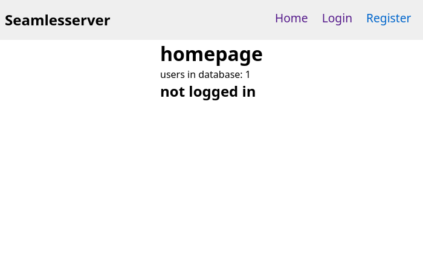
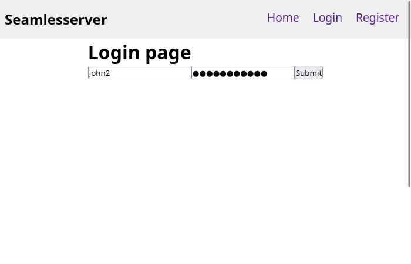

<div align=center>


# **seamlesserver**

#### A web template that backend and frontend are seamless connected!

**[About](#about) - [Stack](#stack) - [Features](#features) - [How it Works](#how-it-works) - [Getting started](#getting-started)** - [License](#license)

---

> **Warning**
> This project isn't finished, the following screenshots are far away from the final version. Many features needs to be implemented and more tests need to be made.

---




</div>

## About

This template implements a basic fullstack system seamless connected between backend and frontend.

The backend renders the **exactly** same page as backend, using **exactly** same model!

The page switching is made by Javascript, changing url adding to history with `history.pushState`. So you can browse with the speed of a SPA website or you can use the whole site without Javascript, thanks to SSR.

## Stack (ProNoK?)

This template is built in [Nim language][nimlang] using the following library and frameworks:

- **Web Framework**: [Prologue][prologue]
- **ORM**: [Norm][norm]
- **Backend HTML generation and SPA frontend framework**: [Karax][karax]

## Features

### Insanely fast

After first load, the pages changes instantly with Karax

### Just one page model

You can pre-render the pages in the server side and re-render the same model at browser with Javascript as a SPA!

### Bridged data

The server sends to frontend a [`BridgedData`][bridgedDataDef] serialized as JSON and Javascript re-serialize it back to be ready to use.


### User registration and login

There's a simple [`User`][userDef] implementation with following fields:

- username
- email
- password

The user password is hashed using `bcrypt` hash, with a random salt for each user.

### PWA

By default, this template is installable, and all SPA available routes are cached!

## How it Works

### Rendering

The HTML rendering models are defined at [seamlesserverpkg/renderer/routes](src/seamlesserverpkg/renderer/routes), everything is reused, even states objects are shared!

The renderer receives a reference to a [`State`][stateDef], it contains a instance of [`BridgedData`][bridgedDataDef] and a list of errors (flash messages). It returns an [`Rendered`][renderedDef], an object that contains the rendered `VNode` and the page title.

The server renders the page with a blank state, since it's on server side.

When your browser receive the rendered webpage, it is just a static page, but the Javascript will re-render the page as a SPA application, using the same models defined in backend.

The SPA will change the pages without reloading and the state will be preserved, and even if you reload the page, the state will be stored in your browser's LocalStorage.

## Getting started

### Dependencies

```bash
npm install -g sass
```

### Setup

Before start, rename the whole project with:

```bash
$ nimble rename_project myFullstackApp
```

Keep in mind that it'll rename the whole project as many times you want.

### Running

And to run is extremely simple!

```bash
$ nimble r # build and run, for development purposes
```

The above command will compile the javascript, create `.env` and `public/` in
`build/` if not exists, then compile and run the server!

But if you want to compile and run just the server, just run:

```bash
$ nimble build_server # development build
# or
$ nimble build_server_release # production build

# and
$ nimble run_server # run it
```

Or if you want to compile just the Javascript, run:

```bash
$ nimble build_js # development build
# or
$ nimble build_js_release # production build
```

## License

This template is free and open source software licensed over MIT license.

<!-- Refs -->

[nimlang]: https://nim-lang.org "Nim Language official website"
[karax]: https://github.com/karaxnim/karax
[bridgedDataDef]: ./src/seamlesserverpkg/renderer/base/bridgedData.nim
[stateDef]: ./src/seamlesserverpkg/renderer/base/state.nim
[renderedDef]: ./src/seamlesserverpkg/renderer/base/rendered.nim
[bcrypt]: https://github.com/nim-lang/checksums/blob/master/src/checksums/bcrypt.nim
[prologue]: https://github.com/planety/prologue
[norm]: https://github.com/moigagoo/norm
[userDef]: ./src/seamlesserverpkg/db/models/user.nim#L10
